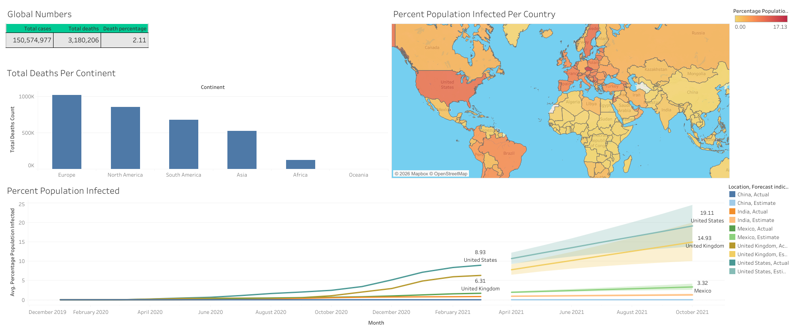
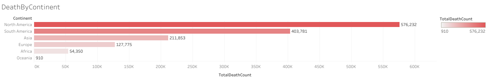
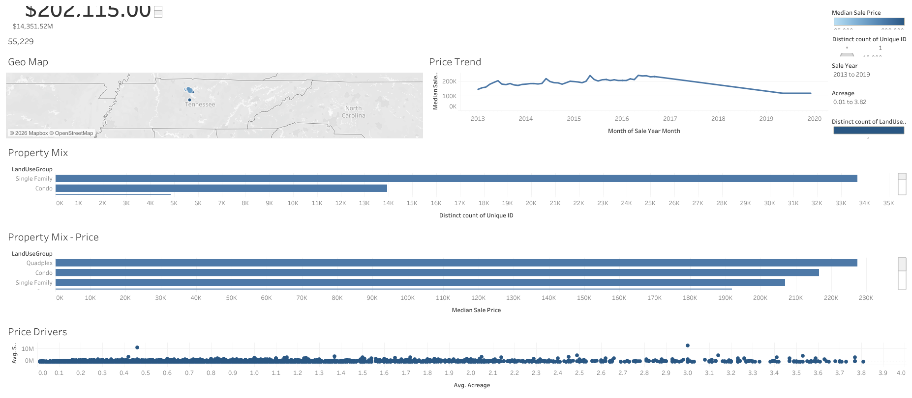

# SQL Data Analysis & Tableau Visualization Projects

This repository contains two end-to-end data projects that combine SQL for data cleaning/analysis with Tableau for visualization. 
Each project takes raw data through querying, transformation, and analysis in SQL, then presents the findings in an interactive Tableau dashboard.

## 📁 Repository Structure

```
├── Data_Exploration_Covid19.sql                     # COVID-19 data exploration (SQL Server)
├── Covid19.png, Covid19DeathByContinent.png         # Tableau dashboard screenshot - COVID-19 analysis
├── Data_Cleaning_NashvilleHousing.sql               # Nashville Housing data cleaning (SQL Server)
└── NshvilleHousingOverview.png                      # Tableau dashboard screenshot - Nashville Housing
```


## 🦠 Project 1: COVID-19 Data Exploration

**Files:** `Data_Exploration_Covid19.sql `, `Covid19.png` and `Covid19DeathByContinent.png`

An exploratory analysis of global COVID-19 case, death, and vaccination data using T-SQL, culminating in a Tableau dashboard.

**SQL analysis performed:**
- Queried case and death counts by location and date, filtering to country-level records only (`continent IS NOT NULL`).
- Calculated **death percentage** (total deaths / total cases) to estimate the likelihood of dying if infected, for specific countries (e.g., United States).
- Calculated **percentage of population infected** by country (e.g., India) to track the spread of the virus over time.
- Identified countries with the **highest infection rate relative to population**.
- Identified countries and continents with the **highest total death counts**.
- Calculated **global rolling totals** for cases, deaths, and overall death percentage.
- Joined `CovidDeaths` and `CovidVaccinations` tables to calculate a **rolling count of people vaccinated** per location using `SUM() OVER (PARTITION BY ... ORDER BY ...)`.
- Used a **CTE** and a **temp table** to calculate percentage of population vaccinated.
- Created a **SQL View** (`PercentPeopleVaccinated`) to store the vaccination rollup for use in Tableau.

**Key SQL techniques used:** window functions (`SUM() OVER PARTITION BY`), CTEs, temp tables, views, joins, aggregate functions, type casting (`CONVERT`/`CAST`).

**Tableau Dashboard:**
The dashboard visualizes:
- Global totals for cases, deaths, and death percentage
- Total deaths by continent
- Percent of population infected by country (world map)
- Percent of population infected over time for selected countries (United States, United Kingdom, India, Mexico, China), including a forecasted trend

, 


---

## 🏠 Project 2: Nashville Housing Data Cleaning

**Files:** `Data_Cleaning_NashvilleHousing.sql`, `NshvilleHousingOverview.png`

A data cleaning project on the Nashville Housing dataset using T-SQL, preparing raw property sales data for analysis and visualization in Tableau.

**Steps performed:**
1. **Standardize date format** — Converted the `SaleDate` column to a proper `Date` type and added a new `SaleDateConverted` column.
2. **Populate missing property addresses** — Used a self-join on `ParcelID` to fill in missing `PropertyAddress` values from other records sharing the same parcel.
3. **Break out addresses into individual columns**
   - Split `PropertyAddress` into `PropertySplitAddress` and `PropertySplitCity` using `SUBSTRING()` and `CHARINDEX()`.
   - Split `OwnerAddress` into `OwnerSplitAddress`, `OwnerSplitCity`, and `OwnerSplitState` using `PARSENAME()` (by first replacing commas with periods).
4. **Standardize categorical values** — Converted `SoldAsVacant` values from `Y`/`N` to `Yes`/`No` for consistency.
5. **Identify duplicate records** — Used `ROW_NUMBER()` with a `PARTITION BY` across `ParcelID`, `PropertyAddress`, `SaleDate`, `SalePrice`, and `LegalReference` to flag duplicate rows.
6. **Remove unused columns** — Dropped the original unsplit/unconverted columns (`SaleDate`, `OwnerAddress`, `TaxDistrict`, `PropertyAddress`) once cleaned versions were created.

**Key SQL techniques used:** window functions (`ROW_NUMBER()`), CTEs, self-joins, string functions (`SUBSTRING`, `CHARINDEX`, `PARSENAME`, `REPLACE`), `CASE` statements, `ALTER TABLE`/`UPDATE`.

**Tableau Dashboard:**
The dashboard visualizes:
- Median sale price and total sale volume across the dataset
- Geographic distribution of sales (Tennessee/Nashville area)
- Median sale price trend over time (2013–2019)
- Property mix by land use group (Single Family, Condo, Quadplex, etc.)
- Median sale price by land use group
- Relationship between acreage and sale price



---

## 🛠️ Tools
- **Database:** SQL Server
- **Visualization:** Tableau
- **Techniques:** CTEs, window functions, joins, temp tables, views, string/date functions, data standardization
